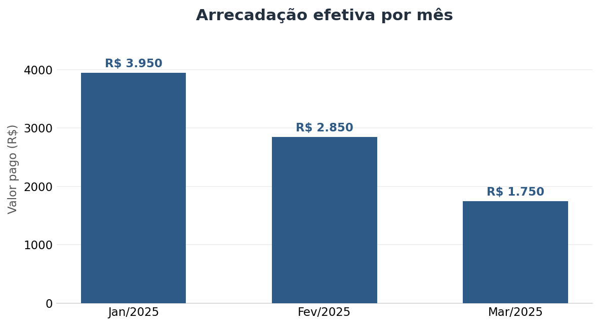
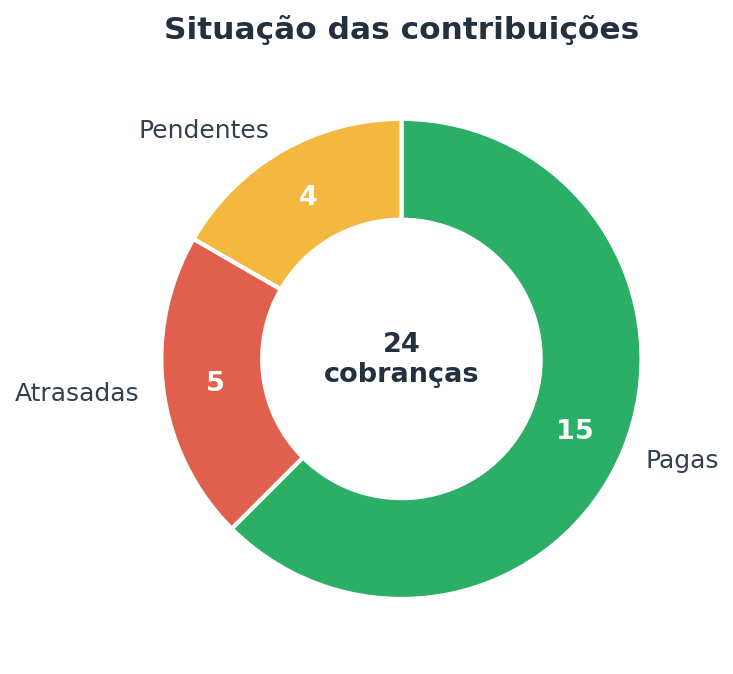
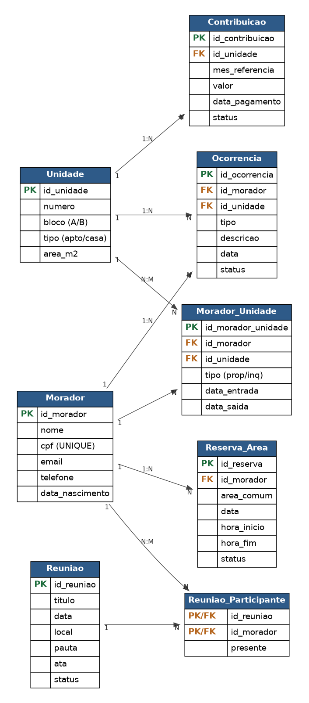

# 🏢 Sistema de Gestão para Associação de Moradores

Imagina uma associação de moradores tentando controlar tudo no papel e no grupo de WhatsApp: quem mora em cada apartamento, quem pagou o condomínio, as reclamações que aparecem toda semana, as reuniões e a reserva do salão de festas. Vira uma bagunça rápido, e na hora que alguém pergunta "quanto entrou esse mês?" ninguém sabe responder na hora.

Esse projeto resolve exatamente isso. A gente montou um banco de dados que junta todas essas informações em um lugar só e consegue responder, em segundos, perguntas que antes davam horas de planilha.

> Projeto desenvolvido para a disciplina de Banco de Dados (CEAPI) do curso de Ciência de Dados e Inteligência Artificial da PUC-SP.

## 🎯 O problema que a gente quis resolver

Quando o controle é feito de forma espalhada e manual, alguns problemas aparecem o tempo todo:

- Ninguém sabe na hora quem está devendo, de qual mês e quanto.
- O histórico se perde quando troca o inquilino ou o dono de uma unidade.
- Reclamações somem no meio das conversas e ficam sem solução.
- Duas pessoas reservam o salão no mesmo dia e dá conflito.
- As decisões das reuniões ficam só na memória de quem estava lá.

A ideia foi trazer organização e clareza pra essa rotina, sem depender de planilha solta.

## 💡 A nossa solução

Um banco de dados relacional em SQLite com 8 tabelas que conversam entre si. Tudo fica numa base única e confiável, de onde a diretoria consegue tirar relatórios na hora: quem está inadimplente, quanto foi arrecadado no mês, quais ocorrências estão em aberto e o histórico de quem morou onde.

## 📊 O que dá pra enxergar com os dados

### Quanto entrou em cada mês

A consulta soma só o que foi realmente pago, então a diretoria sabe exatamente quanto dinheiro entrou no caixa.



### O termômetro da inadimplência

De um lado quem está em dia, do outro quem está pendente ou atrasado. Dá pra ver a saúde financeira da associação num piscar de olhos.



## 🗺️ Como o banco foi modelado

São 8 tabelas no total. A parte mais legal são as duas tabelas do meio (`Morador_Unidade` e `Reuniao_Participante`), que ligam coisas que se relacionam de "muitos para muitos". Por exemplo: um morador pode passar por várias unidades ao longo do tempo, e uma reunião tem vários participantes. Sem essas tabelas no meio, não daria pra representar isso direito.

<p align="center">
  
</p>

## 🛠️ Ferramentas que usamos

- `SQLite 3` como banco de dados
- `SQL` para criar as tabelas, inserir os dados e fazer as consultas
- `Python 3` com as bibliotecas `sqlite3` e `pandas`
- `Jupyter Notebook` para rodar tudo e ver os resultados em tabela

## 🚀 Como executar

Tem três jeitos, do mais simples ao mais completo:

**1. Só abrir o banco pronto**
Baixe o [DB Browser for SQLite](https://sqlitebrowser.org/), abra o arquivo `database/associacao_moradores.db` e já dá pra rodar as consultas.

**2. Recriar pelo script**
```bash
sqlite3 associacao_moradores.db < sql/associacao_moradores.sql
```

**3. Rodar o notebook (recomendado)**
```bash
pip install pandas notebook
jupyter notebook notebook/Projeto_Banco_de_Dados.ipynb
```
O notebook cria o banco, insere os dados e roda todas as consultas mostrando o resultado em tabelas.

## 📂 O que tem no repositório

| Pasta | O que tem dentro |
|-------|------------------|
| `sql/` | O script completo: criação das tabelas, dados de teste e consultas |
| `notebook/` | O projeto inteiro num notebook que roda sozinho |
| `docs/` | Documentação completa, o diagrama do banco e os gráficos |
| `database/` | O banco já montado e populado, pronto pra abrir |

## 👥 Integrantes

Projeto feito em grupo para a disciplina de Banco de Dados (CEAPI) da PUC-SP:

- **Carlos Calil**
- **Pedro Carvalho**
- **Alexander Haug**

<p align="center"><i>PUC-SP · Ciência de Dados e Inteligência Artificial · 2025</i></p>
